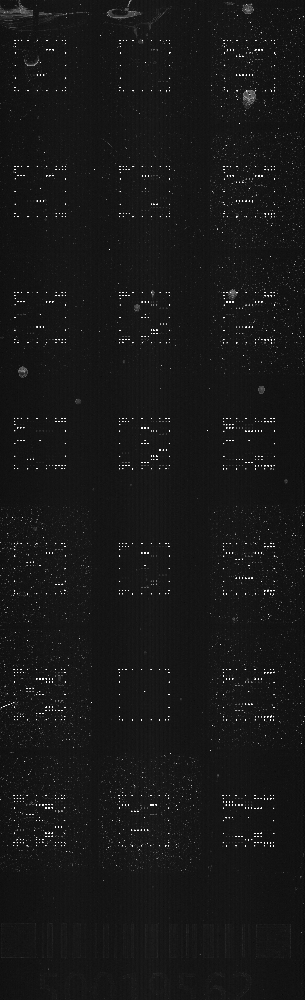
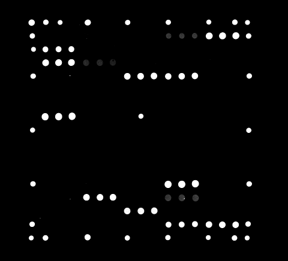
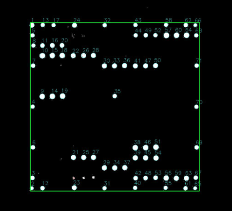
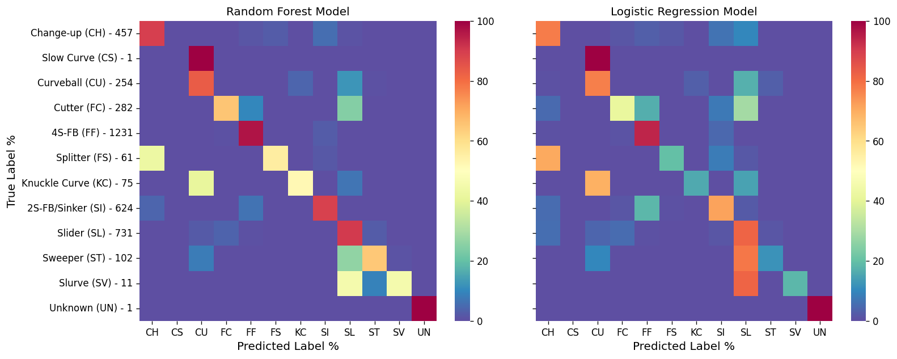
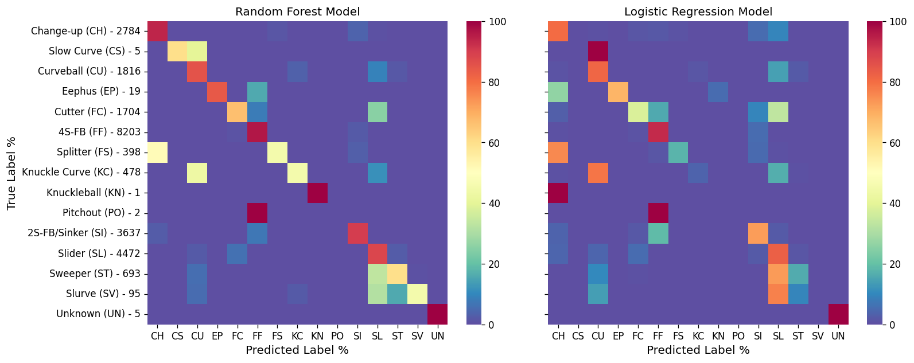

## Andrew Bremner's Data Science Portfolio
email: andrew.m.bremner@gmail.com

# [Project 1: Micro Array Processor](https://github.com/andrewbremner3/Micro_Array_Processor)
Streamlit based Python App that take the input of a raw .tif image file from a slide scanner with 21 microarrays and processes them to output the intensities of the features using an input map and ID key to sort and average replicate features.

Below are example imaged of the raw .tif image file from the slide scanner, then one zoomed in well to show the mocro array and fianllay the processed microarray with the featured circles and picked out.
<table>
    <tr>
    <td style="text-align:center">Whole slide</td>
    <td style="text-align:center">One microarray</td>
    <td style="text-align:center">Processed microarray</td>
  </tr>
  <tr>
    <td>
      
    </td>
    <td>
      
    </td>
    <td>
      
    </td>
  </tr>
</table>

## App Overview
The app can be run from the command line with "streamlit run MicroArrayProcessor_StreamlitApp.py" which then open in a browser.
Processing steps are:
<ol>
    <li>There are some parameters that allow for some customization of the app (use the auto generated ones with the test images.</li>
    <li>Click the "Run Image Process" botton to start (script takes a few second to run).</li>
    <li>Reads the .tif file in using opencv (for tresholding, masking and controuing the features) as well as a numpy array for gathering the intesity values of the pixels).</li>
    <li>Splits the slide image into 24 wells (only use 21 since bottom 3 wells are always empty).</li>
    <li>Thresholds the microarray image so everyhting above the background * ratio_multiplier is set to 1 and everything below is 0.</li>
    <li>Labels all of the found features by drawing red circles around them.</li>
    <li>Finds the top left feature of the square/rectagular microarray using the expected height, width and pitch (distance between features) and performing a convolution of the 'expected' array map with the found array and setting the correct location to wherethe convolution is greatest.</li>
    <li>Draws a boundry of where the 'real' features are expected using the origin found. Then Label all of the features inside the expected boundry with cyan circles (shows the success or failure of the processign very easily).</li>
    <li>Creates an intermediate output .csv file with the raw data of the location in the array and the intesity found.</li>
    <li>Check that the gnerated images so that hte green rectagle is outlining all the microarrays.</li>
    <li>**Click the "Run Data Process** to finish the script.</li>
    <li>Reads back in the intermediate .csv file and use the map.csv and ID.csv files to determine the identity of each location in order to group and average the replicate featured together.</li>
    <li>Creates the final output file with the averaged and sorted data for the simple output of intesity per spot per well.</li>
</ol>

**Done!**

The provided images have been compressed for github to handle so the output intesities have been altered by the compression process but the code and output images and files still show a full piture of the app's capabilities.

# [Project 2: MLB pitch classifier](https://github.com/andrewbremner3/MLB_Pitch_Classifier)
This script takes two months worth of statcast data from the 2022 season (~250,000 pitches) and builds two machine learning models (Random Forest and Logistic Regression) to determine what type of pitch is thrown. 
The data is cleaned and processed such that only the fields that make sense to a distinct pitch are used. 

These include:
* Release Speed
* Release spin rate
* Spin axis
* Velocity x, y, and z vectors at 50 feet from home plate
* Acceleration x, y, and z vectors at 50 feet from home plate
* Horizontal and vertical movement

The package used for accessing the statcast data is: https://pypi.org/project/baseball-scraper/

Pitch_Data_small.csv file is provided since accessing the statcast data can take some time, so just import the .csv into pandas for faster use.

## Results on small data set of 10 days
The accuracy score results of the small data set are:
* RandomForest was 0.87781, in a time of 7.40s
* LogisticRegression was 0.76005, in a time of 1.43s

Heat map charts below show the two models' results where the left axis shows the pitch name and how many instances were found in the test set. There is a lot of agreement in the two models but the Random Forest is more accurate while the Logistic Regression is much faster.

## Results on larger Data set 2 months (.csv is too large for github)
**Note that more pitch types are found in the larger set**

The accuracy score results of the larger data set are:
* RandomForest was 0.87607, in a time of 59.46s
* LogisticRegression was 0.76279, in a time of 77.23s

Same charts as above. This tiem the Random forest is both faster and more accurate than the Logistic Regression (Both are pretty slow still).

## Points of interest
* The "Slow Curve" pitch is found to be a "Curveball" quite often so could be lumped in (also only 5 instances).
* "Pitch outs" are always found as "Fastballs" which makes since a "PO" is thrown to try and stop a runner from; so it is essentially a fastball outside the zone.
* "Slider", "Sweeper", "Cutter" and "Slurve" all have a lot of overlap as all those pitches have similar movement. A lot of horizonatal break compared to all the others.
* The"Eephus" and "Fastball" should not overlap at all as they are complete opposite pitches but I would assume there is some odd behavior with the addition of position players throwing as slow as possible and having "Eephus" and "Fastballs" overlap.
