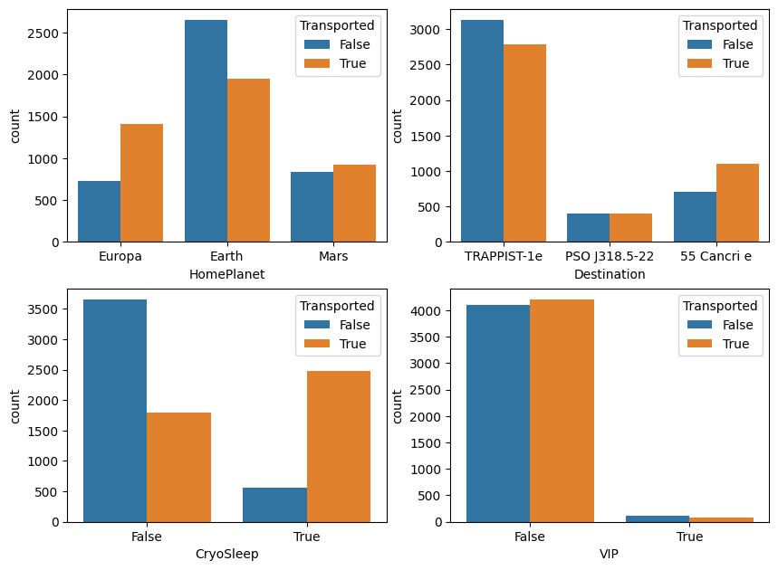
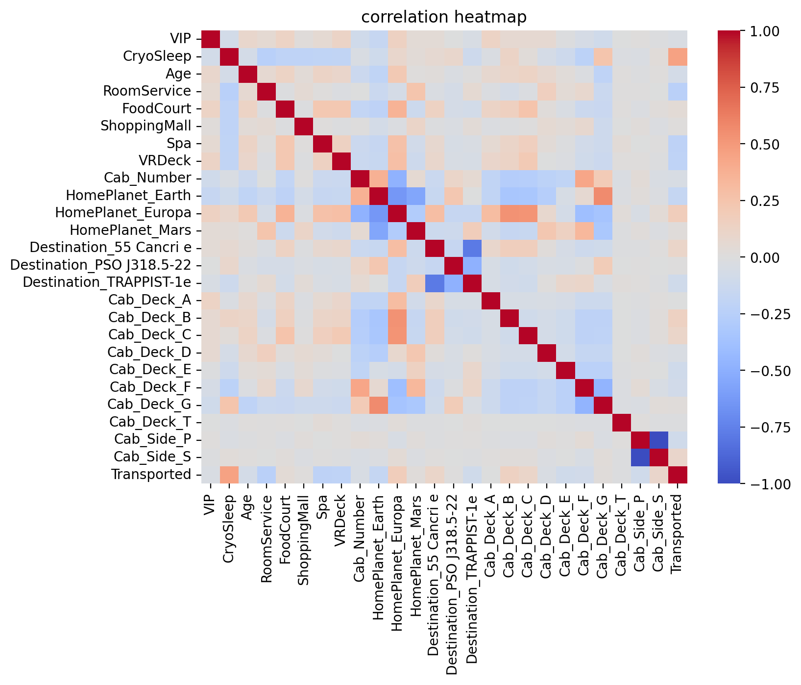
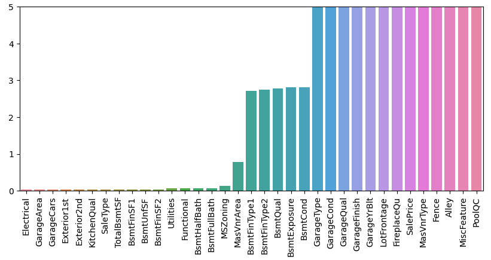

## [Andrew Bremner's Portfolio](https://github.com/andrewbremner3)
email: andrew.m.bremner@gmail.com

# [Project 1: MLB pitch classifier](https://github.com/andrewbremner3/MLB_Pitch_Classifier)
This script takes two months worth of statcast data from the 2022 season (~250,000 pitches) and builds two machine learning models (Random Forest and Logistic Regression) to determine what type of pitch is thrown. 

**Goal: Predict the pitch thrown based on pitch tracking data of velocity and movement from Statcast.**

The data is cleaned and processed such that only the fields that make sense to a distinct pitch are used. 

These include:
* Release Speed
* Release spin rate
* Spin axis
* Velocity x, y, and z vectors at 50 feet from home plate
* Acceleration x, y, and z vectors at 50 feet from home plate
* Horizontal and vertical movement

The package used for accessing the statcast data is: https://pypi.org/project/baseball-scraper/

Pitch_Data_small.csv file is provided since accessing the statcast data can take some time, so just import the .csv into pandas for faster use.

## Results on small data set of 10 days
The accuracy score results of the small data set are:
* RandomForest was 0.87781, in a time of 7.40s
* LogisticRegression was 0.76005, in a time of 1.43s

Heat map charts below show the two models' results where the left axis shows the pitch name and how many instances were found in the test set. There is a lot of agreement in the two models but the Random Forest is more accurate while the Logistic Regression is much faster.

## Results on larger Data set 2 months (.csv is too large for github)
**Note that more pitch types are found in the larger set**

The accuracy score results of the larger data set are:
* RandomForest was 0.87607, in a time of 59.46s
* LogisticRegression was 0.76279, in a time of 77.23s

Same charts as above. This tiem the Random forest is both faster and more accurate than the Logistic Regression (Both are pretty slow still).

## Points of interest
* The "Slow Curve" pitch is found to be a "Curveball" quite often so could be lumped in (also only 5 instances).
* "Pitch outs" are always found as "Fastballs" which makes since a "PO" is thrown to try and stop a runner from; so it is essentially a fastball outside the zone.
* "Slider", "Sweeper", "Cutter" and "Slurve" all have a lot of overlap as all those pitches have similar movement. A lot of horizonatal break compared to all the others.
* The"Eephus" and "Fastball" should not overlap at all as they are complete opposite pitches but I would assume there is some odd behavior with the addition of position players throwing as slow as possible and having "Eephus" and "Fastballs" overlap.

# [Project 2: Micro Array Processor](https://github.com/andrewbremner3/Micro_Array_Processor)
Streamlit based Python App that take the input of a raw .tif image file from a slide scanner with 21 microarrays and processes them to output the intensities of the features using an input map and ID key to sort and average replicate features.

**Goal: Input a raw .tif file and process the image for each microarray and report the individual feature intesities.**

Below are example imaged of the raw .tif image file from the slide scanner, then one zoomed in well to show the mocro array and fianllay the processed microarray with the featured circles and picked out.
<table>
    <tr>
    <td style="text-align:center">Whole slide</td>
    <td style="text-align:center">One microarray</td>
    <td style="text-align:center">Processed microarray</td>
  </tr>
  <tr>
    <td>
      
    </td>
    <td>
      
    </td>
    <td>
      
    </td>
  </tr>
</table>

## App Overview
The app can be run from the command line with "streamlit run MicroArrayProcessor_StreamlitApp.py" which then open in a browser.
Processing steps are:
<ol>
    <li>There are some parameters that allow for some customization of the app (use the auto generated ones with the test images.</li>
    <li>Click the "Run Image Process" botton to start (script takes a few second to run).</li>
    <li>Reads the .tif file in using opencv (for tresholding, masking and controuing the features) as well as a numpy array for gathering the intesity values of the pixels).</li>
    <li>Splits the slide image into 24 wells (only use 21 since bottom 3 wells are always empty).</li>
    <li>Thresholds the microarray image so everyhting above the background * ratio_multiplier is set to 1 and everything below is 0.</li>
    <li>Labels all of the found features by drawing red circles around them.</li>
    <li>Finds the top left feature of the square/rectagular microarray using the expected height, width and pitch (distance between features) and performing a convolution of the 'expected' array map with the found array and setting the correct location to wherethe convolution is greatest.</li>
    <li>Draws a boundry of where the 'real' features are expected using the origin found. Then Label all of the features inside the expected boundry with cyan circles (shows the success or failure of the processign very easily).</li>
    <li>Creates an intermediate output .csv file with the raw data of the location in the array and the intesity found.</li>
    <li>Check that the gnerated images so that hte green rectagle is outlining all the microarrays.</li>
    <li>**Click the "Run Data Process** to finish the script.</li>
    <li>Reads back in the intermediate .csv file and use the map.csv and ID.csv files to determine the identity of each location in order to group and average the replicate featured together.</li>
    <li>Creates the final output file with the averaged and sorted data for the simple output of intesity per spot per well.</li>
</ol>

**Done!**

The provided images have been compressed for github to handle so the output intesities have been altered by the compression process but the code and output images and files still show a full piture of the app's capabilities.

# [Project 3: Spaceship Titanic Classification](https://github.com/andrewbremner3/Spaceship_Titanic)
classification predictions from Kaggle competition [www.kaggle.com](https://www.kaggle.com/competitions/spaceship-titanic) where training and test data sets are provided.

**Goal: Predict if a passanger was transported based on the persons attributes and ticket information.**

### 1) Explore the Train data
Determine which fields are correlated to transport and which fields need to be preprocessed in order to be input into the machine learning models.

Charts showing some of the data exploration.

    
    

### 2) Train data Engineering
Fill empty data with the mode for catagorical fields and mean for numerical fields. Then convert the catagory values with 'dummy' values for input to the training model.

### 3) Repeat Data Engineering on Test data
Test data is held out until final steps.

### 4) Train various models with train data
Split training set into a train and test for the various models so I can check the accuracy of the models for comparison.

Models tested:
* RandomForestClassifier = 0.7987
* GradientBoostingClassifier = 0.7924
* HistGradientBoostingClassifier = 0.8039
* BaggingClassifier = 0.7797

### 5) Final Train and Output
The HistGradientBoostingClassifier has the best score from the tests so that is what is used in the final training set. Ouput the data as Kaggle needs the output for final testing.

The Final Score from the leaderboard = 0.79658.

# [Project 4: Housing Data Regression](https://github.com/andrewbremner3/Housing_Data_Regression)
Regression predictions from Kaggle competition [www.kaggle.com](https://www.kaggle.com/competitions/house-prices-advanced-regression-techniques) where training and test data sets are provided.

**Goal: Predict the price of houses based on various attributes of the houses.**

The data sets are 'un-cleaned' with empty rows and fields that need to be treated in various ways.

### 1) Clean the Data
Combined the Train and Test so that all treatments are done uniformly (necessary for using dummy variables in the following steps).

Image below shows the "percent missing" of the initial data set.

Cleaning Treatments:
* Drop rows that are outliers
* Drop rows that are nearly empty
* Fill empty fields
  * Numerical fields filled with 0
  * Object fields usually filled with 'None'
  * Average of similar values (same Neighborhood) to fill 'LotFrontage' fields
 
### 2) Use training data test protcol
The hypothesis is that the numerical fields could be good enough for a strong model. The other option is to use 'dummy' variables for the catagories or object fields.

* Numerical Data only
  * Time to run: 10.81s
  * Percent error of: 2.28%
* All Data (dummy and numerical)
  * Time to run: 96.33s
  * Percent error of: 1.28%
The extra data makes the fit take ~10x as long but has a measurably better error value.

Try a Random Forest Regression model as well.
* All Data (dummy and numerical)
  * Time to run: 0.33s
  * Percent error of: 1.32%
This model is substantially faster and has a comparable error on test set.

### 3) Final train and test
The dummy variables made the RMSE better so that is what is used for the final Elastic Net setup.
Use the entire training set to train the scaling as well as the Elastic Net model where the best parameters from the previous training were used. (Alpha = 200, l1_ratio = 1, max_iter = 10000).
The results on Kaggle show there is probably over fitting as the score is quite bad at 6.7271

A Random Forest Regression is then tried and shows substantially better results.
The score is 0.1547 which is much better than the Elastic Net model.

# Web Apps in JavaScript and HTML
### Apps built in ["The Complete JavaScript Course 2024: From Zero to Expert!"](https://www.udemy.com/course/the-complete-javascript-course/?utm_campaign=website1010&utm_medium=website1010&utm_source=mycoupon) with [Jonas Schmedtmann](https://codingheroes.io/)

## [Forkify App](https://forkify-andrewbrem.netlify.app/)
Web app that uses the [forkify API](https://forkify-api.herokuapp.com/v2)

**Functionalities:**
* Display searched for items
* Use pagination to show 10 items at a time
* Buttons for adding more and less servings
* Bookmark favorite recipes (add to the bookmark tab as well as icon change)
* Allow to input custom recipes with a form that has a modal window
* Use local storage to hold bookmarks and data

## [Bankist App](https://bankist-app-test.netlify.app/)
Mock marketing page for a banking website that has Features and Operations of the accounts as well as Testimonials for the 'bank accounts.' Also, has a ability to 'Open account' in a modal window.

**Functionalities:**
* Modal functioanlity for the 'open account' buttons.
* Smooth the scrolling from click events to sections of page.
* Highlight the active tabe button and blur other options.
* Increase efficiency of page loading with dynamic loadings for sections as well as with lazy loading of images with blur low quality images that are replaced by higher quality images on scroll events.
* Click event for moving hthrough the options as well as with dots that allow skipping and tracking what option is selected.

# Kaggle PlayGroundSeries
### Kaggle playground prediction series notebooks
---
## [S4 E01: Binary Classification with a Bank Churn Dataset](https://github.com/andrewbremner3/PlayGroundSeries/blob/main/bankchurn-s4e1.ipynb)

[Kaggle Competition Link](https://www.kaggle.com/competitions/playground-series-s4e1/overview)

**Goal: To predict whether a customer continues with their account or closes it (e.g., churns), probablitity of exiting.**

### First: use Sklearn models for catagorical training and testing
* Exploritory data analysis (EDA) to check on balance of the data set and to deal with catagorical fields.
* Test sklearn models on split trainign data set for training time and accuracy (roc_auc_score used)
* Retrain with the model on the entire data set with the best accuracy score for final model, then test and sbmit with probabilities of exiting.
* **Final Evaluation (area under roc curve) = 0.88159**
### Second: use a Neural Network build with Pytorch
* Convert the data to the corrct format (catagories vs continuous fields) then tensors for the NN
* Train the NN with a split data set with few different layer setups to find a good NN setup (2 hidden layers with [101,21] nodes)
* Retrain the NN with the entire data set for the final model, then test and submit with probabilities of exiting.
* **Final Evaluation (area under roc curve) = 0.85983**

---
## [S3 E26: Multi-Class Prediction of Cirrhosis Outcomes](https://github.com/andrewbremner3/PlayGroundSeries/blob/main/predict-cirrhosis-s3e26-pytorch-flexible-model.ipynb)

[Kaggle Competition Link](https://www.kaggle.com/competitions/playground-series-s3e26/overview)

**Goal: To use a multi-class approach to predict the the outcomes of patients with cirrhosis.**

### Create a flexible Neural Network for various continuous and catagorical fields to produce a set of predicted probabilities for each of the three possible outcomes
* Convert catagorical data to dummy variables, use continuous data as it, then convert all to tensor for training.
* Create NN model:
  * Hidden layers: Linear, Batch Norm 1D, ReLU (rectified linear unit), Dropout
  * Final layers: Linear, Softmax (for probability outputs)
* Train on a split data set, check for time and accuracy
* Format the output data set for final submission
* **Final Evaluation (logloss) = 0.66980**

